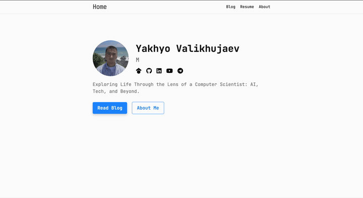

# Personal Website

<p align="center">
  
</p>

[](LICENSE)
[](https://github.com/yakhyo/yakhyo.github.io/actions/workflows/deploy.yml)

Live at [https://yakhyo.github.io](https://yakhyo.github.io)

## Tech Stack

- Jekyll 4.3.4 with Minima theme
- GitHub Pages
- Disqus comments and Google Analytics

## Installation

```bash
git clone https://github.com/yakhyo/yakhyo.github.io.git
cd yakhyo.github.io
bundle install
```

## Development

```bash
# Development mode (default)
bundle exec jekyll serve

# Production mode (for testing production build locally)
JEKYLL_ENV=production bundle exec jekyll serve
```

Visit `http://localhost:4000`

## Build

```bash
# Development build
bundle exec jekyll build

# Production build (minified, optimized)
JEKYLL_ENV=production bundle exec jekyll build
```

**Note:** GitHub Pages automatically builds with `JEKYLL_ENV=production`

## License

MIT License - see [LICENSE](LICENSE) file for details.

## Copyright

© 2024 Yakhyo Valikhujaev. All rights reserved.

- Blog posts, articles, and written content: All rights reserved
- Feel free to use the code structure and design as inspiration
- Please do not copy blog content or personal information
- Attribution is appreciated but not required for code
