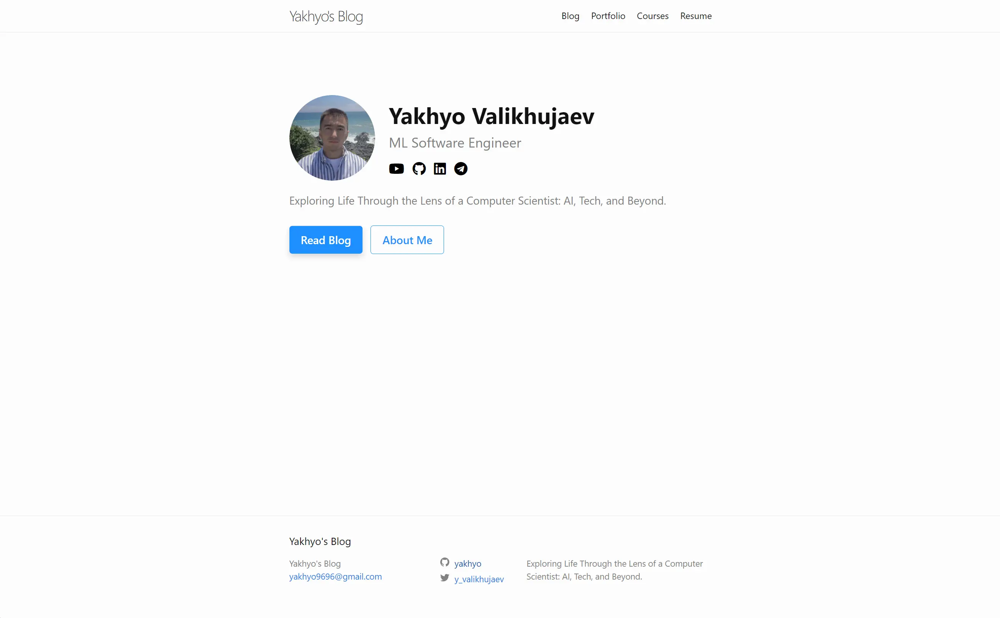

# Custom Github Pages Theme for Blogging


<div align="center">
  
</div>

## Installation Instructions

1. **Clone the Repository**

   ```sh
   git clone https://github.com/yakhyo/yakhyo.github.io.git
   cd yakhyo.github.io
   ```

2. **Install Jekyll and Bundler Gems**

   ```sh
   gem install jekyll bundler
   ```

3. **Install Dependencies**

   ```sh
   bundle install
   ```

4. **Build the Site and Make it Available on a Local Server**

   ```sh
   bundle exec jekyll serve
   ```

5. **Open Your Browser**
   Navigate to `http://localhost:4000` to view your site.

## Additional Notes

- **Configuration:** Edit `_config.yml` to customize your site.
- **Adding Posts:** Add new posts in the `_posts` directory.

For more detailed instructions, refer to the [Jekyll documentation](https://jekyllrb.com/docs/).

## License

This project is licensed under the MIT License. See the [LICENSE](LICENSE) file for details.

Please give credit ❤️ when using this template by linking to this repository.
