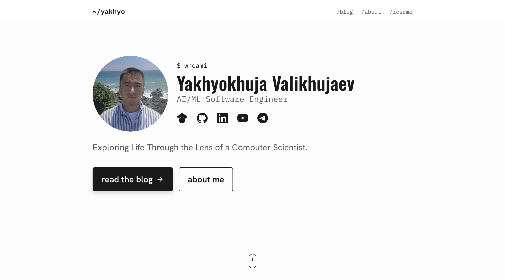

# Yakhyo Valikhujaev - Personal Site and ML Engineering Blog

<p align="center">
  
</p>

[](LICENSE)
[](https://github.com/yakhyo/yakhyo.github.io/actions/workflows/deploy.yml)

Source for [yakhyo.github.io](https://yakhyo.github.io), my personal website and technical blog. The site highlights my work in ML software engineering, MLOps, computer vision, and LLM systems, with a landing page, experience timeline, resume, and long-form engineering posts.

## What is inside

- A Jekyll-powered personal website built on Minima with custom layouts and styles.
- A technical blog under `/blog/` with client-side search, year filters, and topic filters.
- SEO, sitemap, feed, Open Graph, and Twitter Card metadata for shareable pages.
- A resume page and downloadable PDF wired through `_config.yml`.
- Production-only analytics and giscus comments.

## Quickstart

```bash
bundle install                                  # one-time, after cloning
bundle exec jekyll serve                        # local dev at http://localhost:4000
JEKYLL_ENV=production bundle exec jekyll serve  # preview the production build
bundle exec jekyll build                        # one-shot build to _site/
```

Ruby 3.3 (see [.ruby-version](.ruby-version)). The only test runs in CI:
```bash
bundle exec htmlproofer ./_site --disable-external --allow-hash-href \
  --ignore-empty-alt
```

## Tech Stack

Jekyll 4.3 + the Minima theme, heavily customized. Plugins: `jekyll-feed`,
`jekyll-seo-tag`, `jekyll-sitemap`. Comments via giscus (GitHub Discussions),
analytics via Google Analytics — both only load in `production`. Deployed by
GitHub Pages from the `main` branch ([.github/workflows/deploy.yml](.github/workflows/deploy.yml)).

## Repository Layout

```
_posts/<year>/YYYY-MM-DD-slug.md   Blog posts. Permalink: /blog/:year/:month/:title/
_pages/                            Standalone pages (about, blog, resume)
_layouts/                          Page layouts (default, post, home, landing, page)
_includes/                         Partials (header, footer, icon, timeline, giscus, …)
_data/timeline.yml                 Experience entries rendered on the landing page
_sass/                             SCSS partials, imported by assets/main.scss
_drafts/                           Unpublished posts; copy post-template.md to start
assets/css/                        Per-page SCSS bundles (landing, about, resume)
assets/js/                         Per-page JS bundles (site, blog-filter, landing, …)
assets/images/                     Avatar, preview images, post images, company logos
assets/resumes/                    Resume PDF (filename in _config.yml under resume.pdf)
_config.yml                        Site config: title, nav, defaults, plugins, profile URLs
```

## Adding a Blog Post

1. Copy [_drafts/post-template.md](_drafts/post-template.md) to `_posts/<year>/YYYY-MM-DD-your-slug.md` — the filename's date drives the URL.
2. Edit the frontmatter and body. The template's comments explain every field.
3. Run `bundle exec jekyll serve` and visit the post URL.

If you prefer not to use the template, this frontmatter works:

```yaml
---
layout: post
title: "Post title"
date: YYYY-MM-DD 12:00:00 +0900
modified_date: YYYY-MM-DD 12:00:00 +0900   # optional — shows "Updated …"
categories: <single-category-slug>          # e.g. computer-vision; powers topic filter
tags: [kebab-case, tags]
description: "One-line description used in SEO and as the excerpt."
image: /assets/images/your-cover.jpg        # optional; falls back to site default
---
```

If you start from scratch instead of the template, write the content in Markdown.
Code blocks get a copy button automatically. For a table of contents, drop
`{:toc}` after a list.

The topic filter on the blog index only shows categories with ≥ 2 posts.

## Forking This Site

To rebrand this repo as your own personal site, change these 4 things:

1. **`_config.yml`** — site title, description, author, `profiles:` map (all your social URLs), `giscus.*`, `google_analytics`. Single source of truth.
2. **`assets/images/avatar.webp`** — replace with your photo.
3. **`_data/timeline.yml`** — replace experience entries.
4. **`_pages/about.md`** + **`_pages/resume.md`** — rewrite the prose.

Everything else (footer, landing page, resume header) reads its social URLs from `site.profiles.*`, so step 1 fans out automatically.

## Styling

`assets/main.scss` is intentionally just a manifest of imports. Each component's
CSS lives in its own partial under `_sass/`:

| Partial | What's in it |
|---|---|
| `_sass/_tokens.scss` | Colors and shadows — **edit this first** when changing the look |
| `_sass/_base.scss` | Site chrome: typography, icons, utilities, nav, footer, announcement, 404 |
| `_sass/_blog.scss` | Blog index + single-post layout, code blocks, share row |
| `_sass/_timeline.scss` | Experience timeline on the landing page |

Per-page bundles (`assets/css/landing.scss`, `assets/css/about.scss`, …) are
loaded via `custom_css:` in page frontmatter ([_includes/head.html](_includes/head.html)).

## License

Code under [MIT](LICENSE). Blog post content © Yakhyokhuja Valikhujaev; please
do not republish without attribution.
