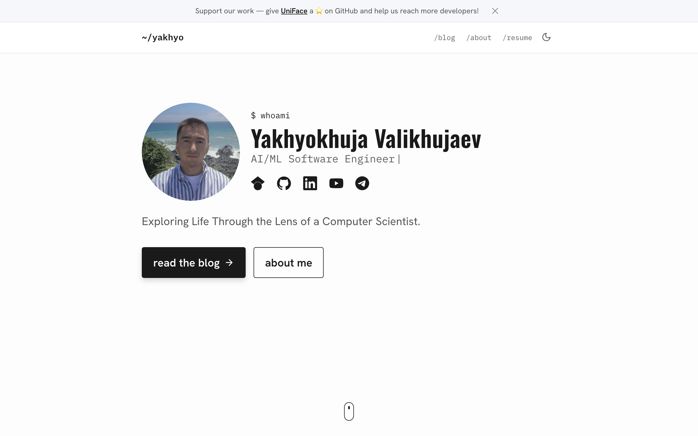
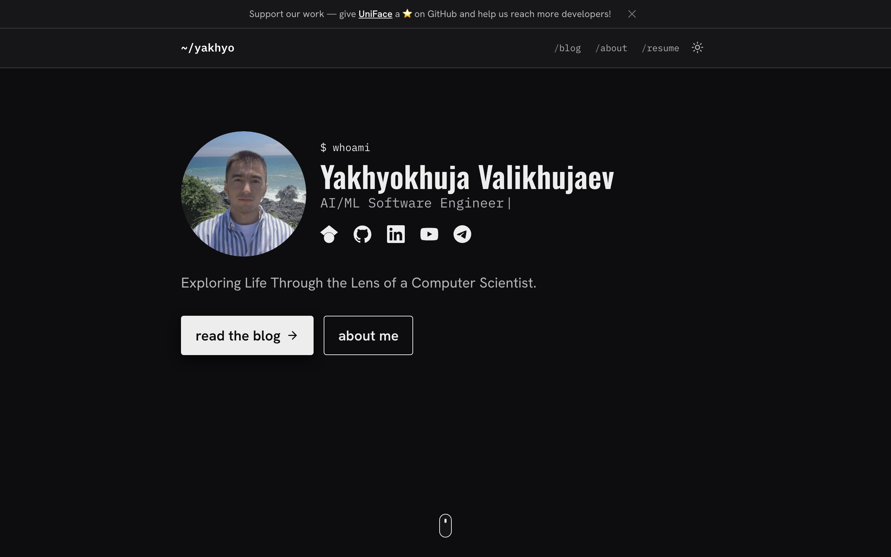

# Personal Blog Built with Jekyll + Minima

<p align="center">
  
  
</p>

[](LICENSE)
[](https://github.com/yakhyo/yakhyo.github.io/actions/workflows/deploy.yml)

This is the source code for [yakhyo.github.io](https://yakhyo.github.io), my personal website and technical blog. It is a Jekyll site based on Minima, customized for a simple landing page, experience timeline, resume, and blog posts.

## Design

The site is mostly monochrome, with a terminal-flavored identity: the `~/yakhyo` wordmark, `/blog /about /resume` nav paths, and a `$ whoami` hero prompt, all set in IBM Plex Mono. Body copy uses Hanken Grotesk; the landing nameplate uses Oswald.

Light and dark themes ship as CSS custom properties (`_sass/_theme.scss`). The active theme follows the OS preference by default; the header toggle sets an explicit choice persisted in `localStorage`, applied before first paint by an inline script in `head.html`. Theme-aware widgets (giscus comments, Mermaid diagrams) re-theme via a `themechange` event from `site.js`.

Styling rules live in two places every change should respect:

- `_sass/_tokens.scss` — single source of truth for colors, type scale, spacing, radii, and shadows. Any value used in more than one place belongs here, not inline.
- `_sass/_mixins.scss` — shared interaction patterns (e.g. `arrow-nudge`, the only sanctioned hover motion; everything else is color-shift only).

## Run Locally

Requires Ruby 3.3 (see `.ruby-version`).

```bash
bundle install
bundle exec jekyll serve
```

The site will be available at [http://localhost:4000](http://localhost:4000).

To build the site:

```bash
bundle exec jekyll build
```

To run the same local HTML check used in CI:

```bash
bundle exec htmlproofer ./_site --disable-external --allow-hash-href \
  --ignore-empty-alt
```

## Structure

```text
_posts/        Blog posts
_pages/        Standalone pages such as About, Blog, and Resume
_layouts/      Jekyll layouts
_includes/     Shared partials (header, icons, timeline, ...)
_data/         Timeline data (experience/education entries)
_sass/         Shared styles: tokens, theme, mixins, base, blog, timeline, syntax
assets/        Compiled CSS entrypoints, per-page styles, JS, images, resume PDF
_config.yml    Site configuration (nav pages, landing titles, profiles)
```

## Dependencies

Gem versions are pinned by `Gemfile.lock` (committed), and CI installs from the
lockfile, so local and deployed builds use identical versions. To upgrade
deliberately:

```bash
bundle outdated          # see what has newer releases
bundle update <gem>      # update the lockfile for that gem
```

## Writing

Blog posts live in `_posts/<year>/` as `YYYY-MM-DD-slug.md` and use this URL format:

```text
/blog/:year/:month/:title/
```

Frontmatter conventions:

- Required: `layout: post`, `title`, `date`, `description` (SEO meta + blog-index excerpt), and a single kebab-case `categories` slug.
- Optional: `tags` (kebab-case, become keywords/JSON-LD), `image` (1200×630 cover for social previews), `modified_date` (surfaces "Updated" on the post), `comments: false` (suppress giscus), `toc_depth: 2` (limit the TOC rail to h2s).

## License

Code is released under the [MIT License](LICENSE). Blog content belongs to Yakhyokhuja Valikhujaev.
